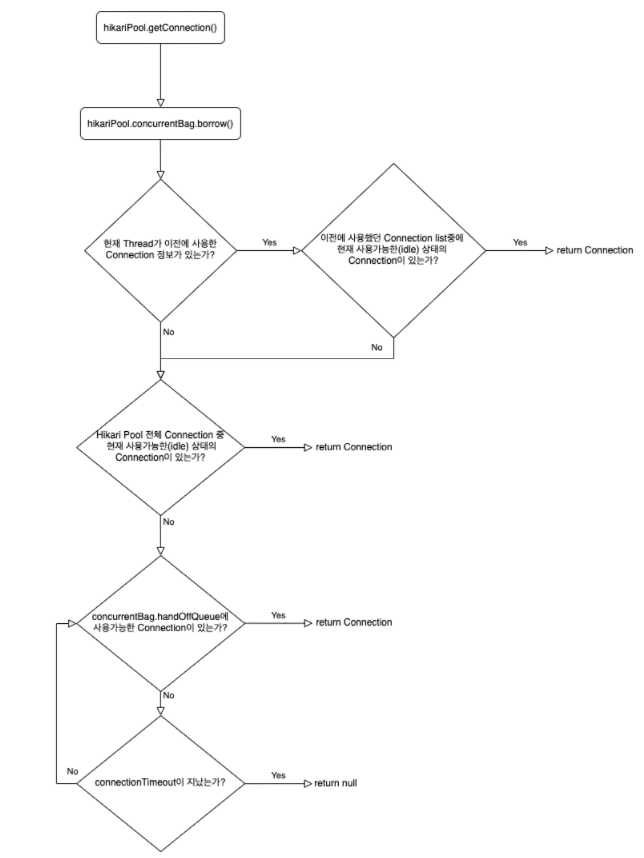

# Connection Pool

### JDBC 란?
java Database Connectivity의 약어로 데이터베이스 종류에 상관없이 자바 프로그램이
데이터베이스와 연결되어 데이터를 주고 받을 수 있게 해주는 프로그래밍 인터페이스이며
```java.sql```, ```javax.sql``` 패키지에 들어있다.

####JDBC API 사용 어플리케이션 기본 구성


### JDBC와 ODBC의 차이점
ODBC(Open Database Connectivity)는 모든 응용 프로그램에서 모든 데이터베이스 시스템과 통신하는데 사용할 수 있는 개방형 인터페이스이다.
즉 JDBC는 Java만 지원하는 것과는 다르게 ODBC는 언어와 독립적이다.

### DBCP 란?
Database Connection Pool의 약자로 Database와 커넥션을 맺고 있는 객체를 관리하는 역할을 한다.

웹 컨테이너(WAS)가 실행되면 Database와 미리 연결을 해놓은 객체들을 Pool에 저장해두었다가
클라이언트 요청이 오면 Connection을 빌려주고 처리가 끝나면 다시 Connection을 반납 받아 Pool에 저장하는 방식을 말한다.


#### DBCP를 사용하는 이유
DBCP를 사용하지 않고 JDBC만 사용하는 경우 DB 접속 시 아래와 같은 순서가 반복되게 된다.

1. DB 접속을 위한 JDBC 드라이버 로드
2. getConnection Method로 부터 DB 커넥션 객체를 얻음
3. 쿼리 수행을 위한 PreparedStatement 객체 생성
4. excuteQuery를 실행해서 결과를 받아옴.

위 과정에서 비효율적인 부분은 1번과 2번이다.
DB 연결 시 마다 Driver를 로드하고 커넥션 객체를 얻는 작업을 반복하게 된다.

DBCP를 사용하게 되면 미리 생성해둔 객체를 Pool에서 가져다 쓰고 반환하기 때문에 1번과 2번 과정을 좀더 효율적으로 바꿀수 있다.

### Hikari Connection Pool
HikariCP는 [Brett Wooldridge](https://github.com/brettwooldridge) 가 2012년 경 개발한 매우 가볍고 빠르고 안정적은 JDBC Connection Pool이며
스프링 부트 2.0부터 HikariCP를 기본 JDBC Connection Pool로 사용할 수 있게 되었다.

#### HikariCP에서 Connection을 리턴하는 방법
HikariCP에서는 내부적으로 ```ConcurrentBag```이라는 구조체를 이용해 Connection을 관리합니다.
```HikariPool.getConnection() -> ConcurrentBag.borrow()```라는 메서드를 통해 사용 가능한(idle) Connection을
리턴하도록 되어있다.




HikariCP에서 얻은 Connection은 (ProxyConnection) Connection.close()를 하게 되면 HikariPool에 반납이 됩니다.
(HikariPool에서 얻은 Connection은 ```ProxyConnection``` 타입입니다.)
정상적으로 transaction이 commit 되거나, 에러로 인해 rollback이 호출 되면 connection.close()가 호출되어
Connection을 Pool에 반납합니다.
getConnection과 마찬가지로 ```connection.close() -> concurrentBag.requite()```이 실행되며 Connection이 반납됩니다.


#### HikariCP에서 Dead lock 피하기

 - issue :  https://github.com/brettwooldridge/HikariCP/issues/442#issuecomment-146096704
 - wiki :  https://github.com/brettwooldridge/HikariCP/wiki/About-Pool-Sizing


### ref
 - [빨간색코딩 JDBC](https://sjh836.tistory.com/147)
 - [[Spring] 커넥션 풀(Connection pool)이란?](https://linked2ev.github.io/spring/2019/08/14/Spring-3-%EC%BB%A4%EB%84%A5%EC%85%98-%ED%92%80%EC%9D%B4%EB%9E%80/)
 - [JDBC, DBCP란? 웹 어플리케이션의 DB접속에 대한 고찰](https://aljjabaegi.tistory.com/402)
 - [Introduction to HikariCP](https://www.baeldung.com/hikaricp)
 - [HikariCP Dead lock에서 벗어나기 (이론편)](https://woowabros.github.io/experience/2020/02/06/hikaricp-avoid-dead-lock.html)
 - [HikariCP Dead lock에서 벗어나기 (실전편)](https://woowabros.github.io/experience/2020/02/06/hikaricp-avoid-dead-lock-2.html)