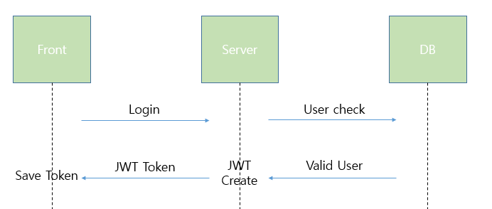
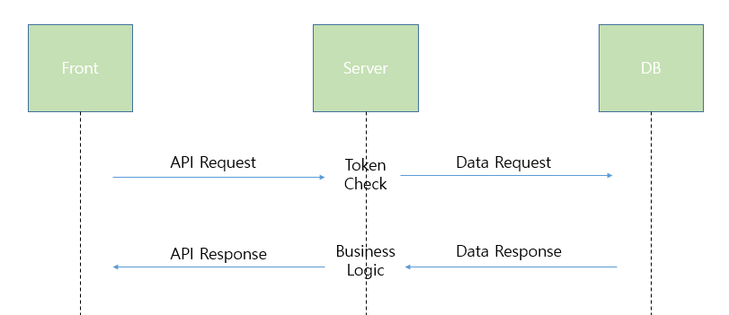
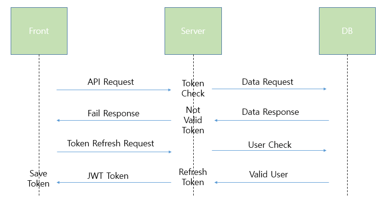

# JWT 란

JSon Web Token의 약자이며 Json 포맷을 이용하여 사용자에 대한 속성을 저장하는 Claim 기반의 Web Token 이다.
JWT는 토큰 자체를 정보로 사용하는 Self-Contained 방식 으로 정보를 안전하게 전달한다.
주로 회원 인증이나 정보 전달에 사용되는 JWT는 아래의 따라서 처리된다.

 - Login Flow

 - Data request Flow(Valid Token)

- Data request Flow(Not Valid Token)

※ 실제 서비스에서 로그아웃이나 만료되지 않은 토큰을 막을 경우 blacklist 테이블을 만들어서 관리하는 방법이나 다른 방법 등을 생각해야한다.

### JWT 구성 요소

JWT는 Header, Payload, Signature 이렇게 총 3가지 부분으로 이루어지며, Json 형태인 각 부분은 Base64로 인코딩 되어 표현된다.
그리고 각각의 부분을 이어주기 위해 구분자로 . 을 사용한다.
JWT Header와 Payload는 디코딩을 하면 평문으로 해독이 가능하기 때문에 인증정보, 비밀번호 같은 민감한 정보를 넣으면 안되지만 Signature는 복호화 할수 없다.

[Base64(HEADER)].[Base64(PAYLOAD)].[Base64(SIGNATURE)]

- Header
  - 헤더는 JWT 토큰을 어떻게 해석해야 하는지를 알려주는 부분이다.
  - typ, alg 두 가자 정보로 구성되어있다.
  - alg : 알고리즘 방식을 지정, 서명 및 토큰 검증에 사용
  - typ : 토큰의 타입을 지정
    
- Payload
  - name / value 쌍으로 이루어져 있다.
  - payload에 있는 속성들을 Claim set 이라고 부른다.
  - payload는 registered claims, public claims, private claims로 구분된다.
  - Registered Claims
    - ss(issuer) : 토큰 발급자
    - sub(subject) : 토큰 제목
    - aub(audience) : 토큰 대상자
    - exp(expiration) : 토큰 만료 시간(NumericDate 형식으로 작성되야 한다.)
    - nbf(not before) : 토큰 활성 날짜
    - iat(issued at) : 토큰 발급 날짜
    - jti(JWT ID) : JWT 토큰 식별자(중복 방지를 위해 사용, 일회용 토큰에 사용시 유용)
  - Public Claims
    - 사용자 정의 클레임으로 공개용 정보를 위해 사용한다. 충돌 방지를 위해 URL 포맷을 이용해야 한다.
  - Private Claims
    - Registered Claims, Public Claims 둘다 아닌 서버와 클라이언트 사이에 임의로 지정한 정보를 저장하기 위해 만들어진 사용자 지정 클레임이다.
    - Private Claims는 조심해서 사용하지 않으면 Registered Claims과 Public Claims 다르게 충돌이 일어날 수 있기 때문에 주의해야한다.

- Signature
  - Header와 Payload는 암호화 한 것이 아니라 단순히 JSON 문자열을 Base64로 인코딩한 것이다.
  - 누구나 디코딩을 하면 Header와 Payload의 내용을 볼 수 있다.
  - 누군가 JWT를 탈취하여 수정한 수 서버로 보낼 수 있다. 이 경우에 대비해 다른 사람이 위변조 했는지 검증하기 위한 부분이다.
  - 서명은 헤더의 인코딩 값, 정보의 인코딩 값을 합친 후 비밀키로 해쉬를 하여 생상한다.

### 장점
 - 훌륭한 확장성
   - 서버 기반 인증에서 보았듯이 세션을 이용한다면 스케일 아웃(서버 확장) 할 때마다 각 서버마다 세션 정보를 저장하게 된다. 사용자1이 [서버 1]에서 로그인 인증을 받았습니다. 그동안 사용자가 증가하여 [서버 2]로 스케일 아웃이 일어났습니다. 그러나 [서버2]는 사용자1이 로그인 했는지를 알지 못한다.
   - 서버가 늘어나도 토큰을 인증하는 방식만 알고 있다면 사용자 인증에 문제가 없다.
   - JWT를 사용하지 않고 세션 전용 서버를 만들어 DB에 저장하는 방법도 있다. 그러나 사용자의 인증이 필요한 API의 모든 요청에 대해서 서버에 조회를 해서 DB의 값을 읽어야 하기에 DB 부하를 만들 수 있다. 이런 점을 고려했을 때 JWT는 훌륭한 확장성을 가지고 있다.
 - 확장성
   - 위에서 확장성과는 다르다.
   - 토큰에 선택적인 권한만 부여하여 발급할 수 있다.
 - 보안성
   - 클라이언트가 서버로 요청할 때 쿠키를 전달하지 않기 때문에 쿠키를 사용함으로써 발생하는 취약점이 사라진다. 그러나 토큰을 사용했을 때 발생하는 취약점에 대해서 대비해야 한다.
 - 여러 도메인
   - 서버 기반 인증 시스템의 문제인 CORS 문제를 해결한다. 쿠키는 발행한 서버에서만 유효하다. www.server-1.covenant.com에서 발행한 토큰은 www.server-2.covenant.com에서 사용할 수 없다. 그러나 JWT는 어떤 도메인에서도 토큰만 유효하다면 처리가 가능하다.
 - 웹 앱 간의 상이한 쿠키 세션 처리
   - 스마트폰이 없던 시절 클라이언트는 웹 브라우저가 유일했다. 그러나 이제 스마트폰, 태블릿과 같이 다양한 모바일 기기로 접근하는 경우를 생각해야 한다. 브라우저의 쿠키 처리 방법과 모바일 기기의 쿠키 처리 방법은 다르다. 따라서 JWT를 이용하는 것이 다양한 디바이스 지원에서 유리하다.

### 단점
 - 데이터 증가에 따른 네트워크 증가
   - 모든 요청에 대해서 토큰이 전송되므로 토큰에 담기는 정보가 증가할 수록 네트워크 부하가 증가한다. 그래서 보통 약자가 많이 사용된다.
 - self-contained
   - 토큰 자체에 정보를 담고 있다. JWT가 만료시간 전에 탈취당하면 서버에서 할 수 있는 것이 없다.
 - Paylaod 인코딩
   - 페이로드 자체는 암호화 된 것이 아니라 Base64로 인코딩 된 것이다. 중간에 Payload를 탈취하여 디코딩하면 데이터를 볼 수 있으므로 JWE로 암호화 하거나 Payload에 중요한 데이터를 넣지 말아야 한다.
 - Stateless
   - JWT는 상태를 저장하지 않기 때문에 한번 만들어지면 제어가 불가능하다. 토큰을 임의로 삭제하는 것이 불가능하므로 만료 시간을 꼭 넣어 주어야 한다.

### JWT와 보안
공격자에 의해서 토큰이 하이재킹 당할 수 있다. JWT를 보호하기 위한 HTTP 헤더 플래그를 설정해야 한다.

- Secure 쿠키
  - HTTPS 프로토콜을 통한 암호 요청만을 통해서 전송할 수 있다.
- HttpOnly
  - 본 플래그를 설정하면 자바 스크립트의 Document.cookie API를 통한 접근이 불가능하다. 오직 서버로만 전송된다.
- SameSite
  - 교차 도메인 전송이 차단된다.
  - CSRF에 대한 보안을 제공한다.
  - 상대적으로 등장한지 얼마 되지 않은 신규 플래그 이다.
- Prefix
  - 브라우저에게 특정 속성이 필요하다고 이야기하는 역할이다.
  - 예시로 Secure-, Host- 가 있다.

### ref
 - [JWT란?](https://covenant.tistory.com/201)
 - [[Server] JWT(Json Web Token)란?](https://mangkyu.tistory.com/56)