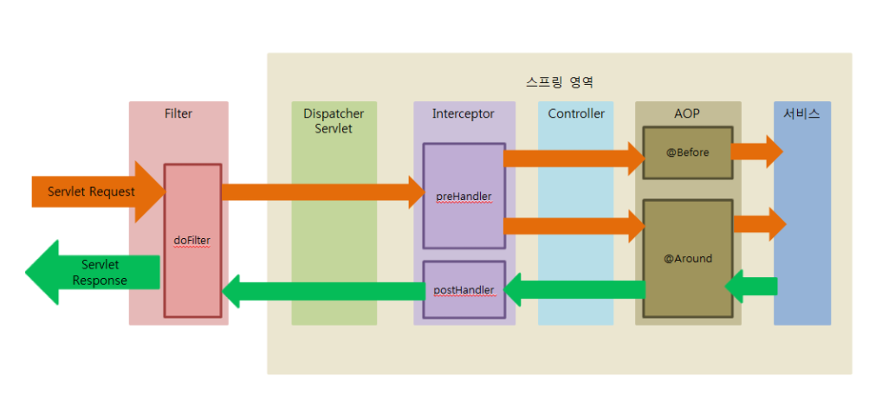

# Spring AOP

### Filter
```Dispatcher Servlet``` 영역에 들어가기 전 Front Controller 앞 범위에서 수행된다.
또한, Controller 이후 자원 처리가 끝난 후 응답 처리에 대해서도 변경, 조각을 수행할 수 있다.
일반적으로 인코딩 변환 처리, XSS 방어를 개발할 때 사용된다.

##### XSS
XSS란 Cross-site Scripting의 약어로
유저가 웹 페이지에 접속하는 것으로 올바르지 않은 스크립트가 실행되는 취약점 또는 공격방법을 말한다.
사이트 간 스크립팅으로 웹 앱에서 많이 나타나는 취약점의 하나이며, 웹 사이트의 관리자가 아닌 일반 유저가 웹 페이지에 악성 스크립트를 삽입할 수 있는 취약점이다.

### Interceptor
```Interceptor```는 스프링의 ```Dispatcher Servlet```이 Contoller를 호출하기 전, 후에 끼어들기 때문에 스프링 컨텍스트 내부에서 Controller에 관한 요창과 응답에 관여하며
모든 스프링 ```Bean```에 접근이 가능하다.

### AOP
Controller 처리 이후 주로 비지니스 로직에서 실행된다.
주로 로깅, 트랜잭션, 에러처리 등 비지니스 단의 메서드에서 구체적인 조정이 필요할 때 사용한다.
```Filter```와 ```Interceptor```와 달리 메소드 전후 지점에서 자유롭게 설정이 가능하다.

### Filter, Interceptor, AOP 흐름


1. 서버를 실행시키면 Servlet이 올라오는 동안에 init이 실행되고, 그 후 ```doFilter```가 실행된다.
2. 컨트롤러에 들어가기 전 ```preHandler```가 실행된다.
3. 컨트롤러에서 나와 ```@Around```, ```postHandler```, ```doFilter``` 순으로 진행된다.
4. 서블릿 종료시 destroy가 실행된다.

```
- Filter -> Interceptor -> AOP -> Interceptor -> Filter 순으로 이루어 진다.
- Filter와 Interceptor는 Servlet 단위에서 일어난다.
```

### ref
 - [Filter, Interceptor, AOP 차이](https://velog.io/@sa833591/Spring-Filter-Interceptor-AOP-%EC%B0%A8%EC%9D%B4-yvmv4k96)
 - [XSS(Cross-Site Scripting) 란?](https://velog.io/@josworks27/XSS-%EA%B0%9C%EB%85%90)